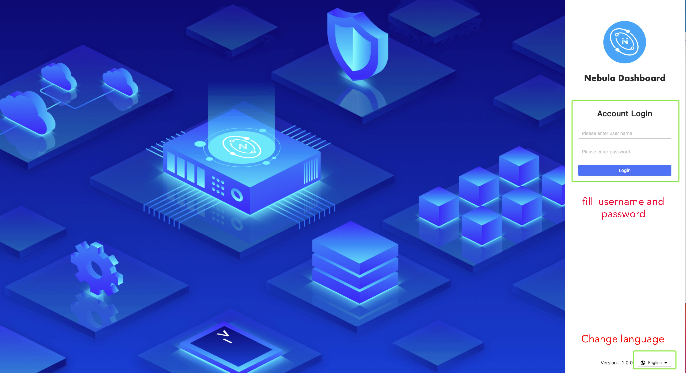
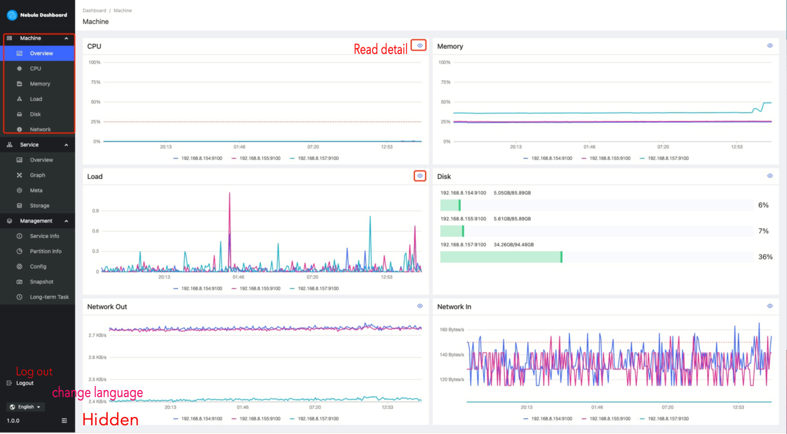
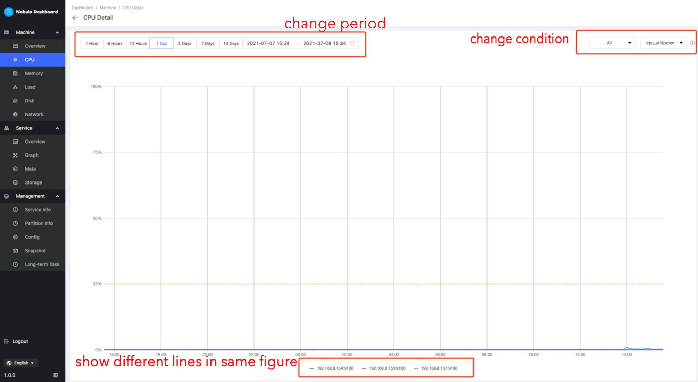
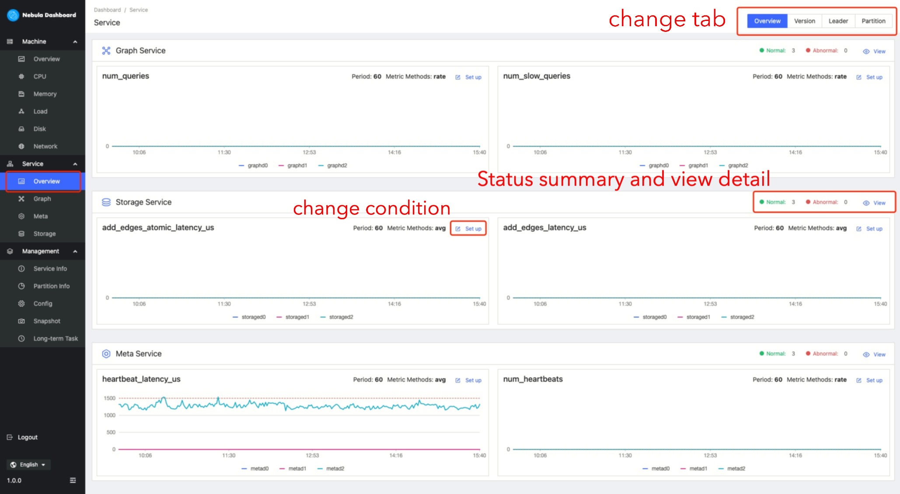
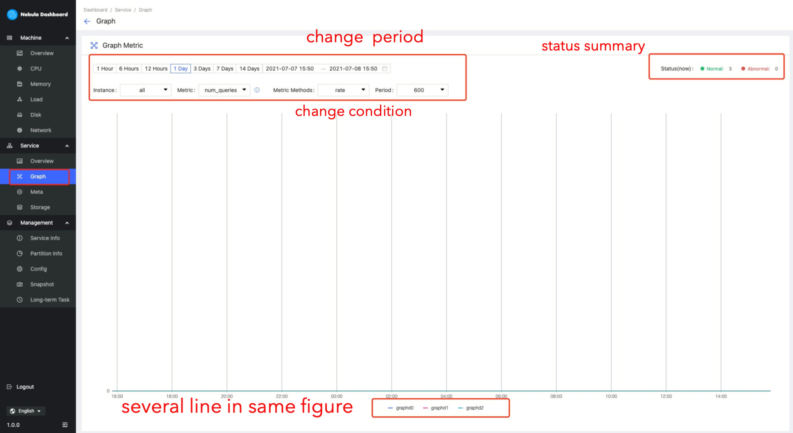
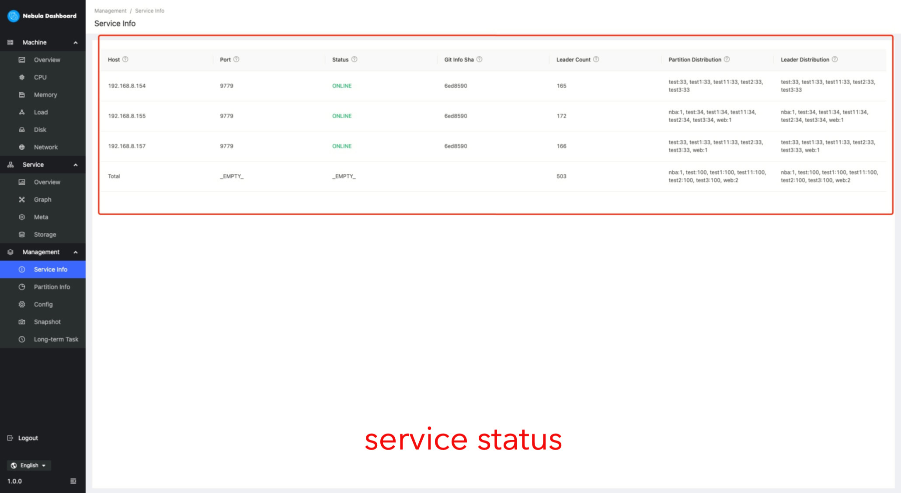
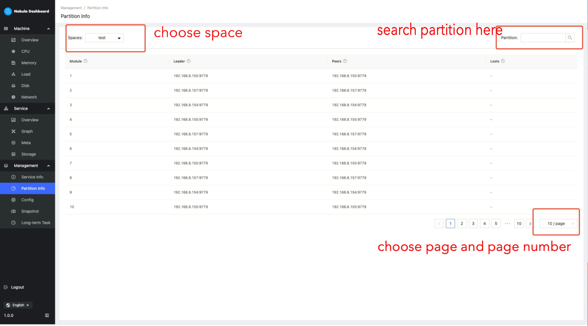
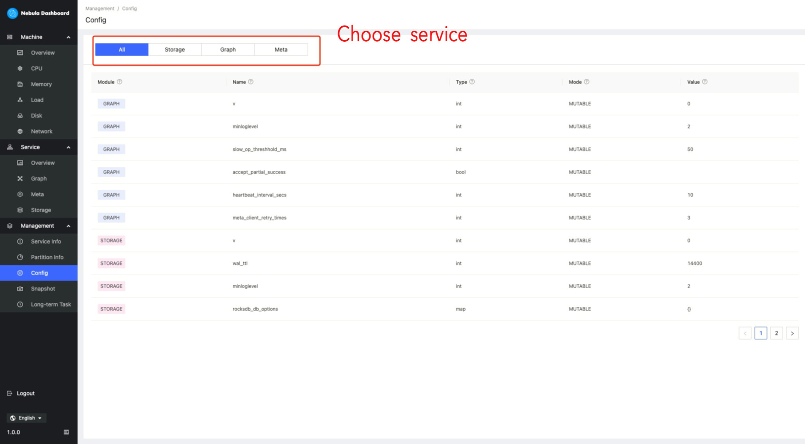

# User Manual

## Download && Deploy && Stop

Refer：[生产部署文档](./DEPLOY.md)

## Start to use
1. Sign in
    Input the username/password to connect to the nebula graph db
    
    

2. Machine Overview
   

Default Tab is Machine OverView.

   

3. Machine Detail

   In CPU tab、Memory tab、Load tab、Disk tab、Network tab，you can see details content 

   

4. Service OverView

    

5. Service Detail

   

6. Manage-service-info

   

7. Manage Partition info

   

8. Manage Config info

   

   

