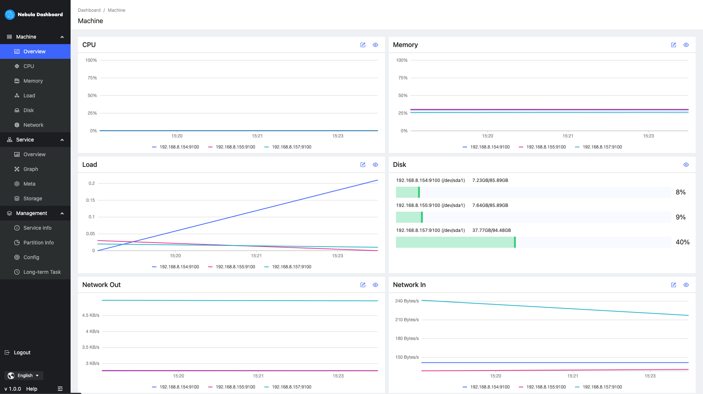
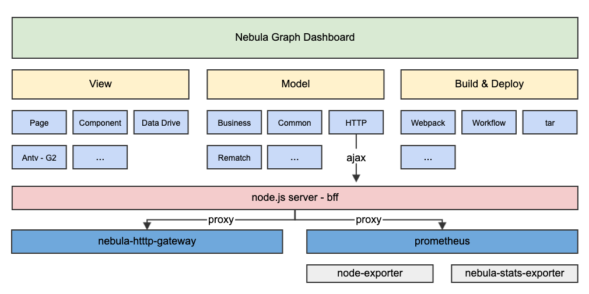

# Nebula Graph Dashboard
Nebula Graph Dashboard is a tool that assists Nebula Graph in daily service monitoring and management



## Architecture


## Deploy in Production
If you plan to set up dashboard in production, refer to：[production guide](DEPLOY.md)

## Development 
#### Prerequisites
- Node.js (>= 10.12.0)
- Go 1.13+ and beego
- Nebula Graph (>=2.0)

#### Quick Start
1. Set up `node-exporter` service where you want to collect machine metrics such as local dev.
    - Download [node_exporter](https://prometheus.io/download/#node_exporter) according to your environment
    - Run 
      ```
        $ tar -xvf node_exporter-{version}.tar.gz
        $ cd node_exporter-{version}
        $ ./node_exporter --web.listen-address=":9100"
      ```

2. Set up `nebula-stats-exporter` to collect your nebula graph service metrics.
    - Download nebula-stats-exporter and build
    - Run
      ```
      $ git clone https://github.com/vesoft-inc/nebula-stats-exporter.git
      $ cd nebula-stats-exporter
      $ make build
      ```

    - Modify `/vendors/nebula-stats-exporter/config.yaml` under nebula-graph-dashboard directory
      ```
      # Example:
      version: v0.0.4
      clusters:
        - name: nebula
          - instance: 
            -name metad0 // instance name as a symble
              endpointIP: 10.17.101.126 // metrics service IP
              endpointPort: 32839 // metrics service Ports
              componentType: metad // metrics service type, should be one of metad,graphd or storaged
            ```
      [More about the nebula graph metrics](https://docs.nebula-graph.com.cn/2.5.0/6.monitor-and-metrics/1.query-performance-metrics/)
    - Run
      ```
      ./nebula-stats-exporter --listen-address=":9200" --bare-metal --bare-metal-config={pwd}/nebula-graph-dashboard/vendors/nebula-stats-exporter/config.yaml &
      ```
  
3. Set up `prometheus`
    - Download [prometheus](https://prometheus.io/download/#prometheus) according to your environment

    - Modify `/vendors/prometheus/prometheus.yaml` according to node-exporter and nebula-stats-exporter ip and port config

    - Run
      ```
      $ tar -xvf prometheus-${version}.tar.gz
      $ cd prometheus-{version}
      $ ./prometheus --config.file={pwd}/nebula-graph-dashboard/vendors/prometheus/prometheus.yaml &
      ```

4. Set up `nebula-http-gateway`

    - Download nebula-http-gateway
      ```
      $ git clone https://github.com/vesoft-inc/nebula-http-gateway.git
      ```
  
    - Modify http port in the `nebula-http-gateway/conf/app.conf` under the installation directory
      ```
      httpport = 8090
      ```
    - Build
      ```
      $ cd /path/to/nebula-http-gateway
      $ make
      ```
    - Run 
      ```
      $ ./nebula-httpd
      ```

5. Start `nebula-graph-dashboard`
    - Modify nebula-graph connection setting: `./static/custom.json`
      ```
      connection: {
        ip: '127.0.0.1', // change to nebula graph service ip
        port: 9669, // change to nebula graph service port
      },
      ```
    - Modify proxy setting: `./vendors/config-release.yaml`
      ```
      port: 7003
      proxy:
        gateway:
          target: "127.0.0.1:8090"  // change gateway service proxy
        prometheus:
          target: "127.0.0.1:9091"  // change prometheus service proxy
      ```

    - Start
      If you want to deploy in development mode, do this way:
      ```
      $ npm install
      $ npm run dev
      ```
      If you want to deploy in production mode, do this way:
      ```
      $ npm install
      $ npm run build
      $ npm run pkg
      $ cp -r vendors/config-release.yaml ./config.yaml
      $ ./dashboard &
      ```

## Documentation 

+ [中文](https://docs.nebula-graph.com.cn/2.5.0/nebula-dashboard/1.what-is-dashboard/)
+ [ENGLISH](https://docs.nebula-graph.io/2.5.0/nebula-dashboard/1.what-is-dashboard/)
